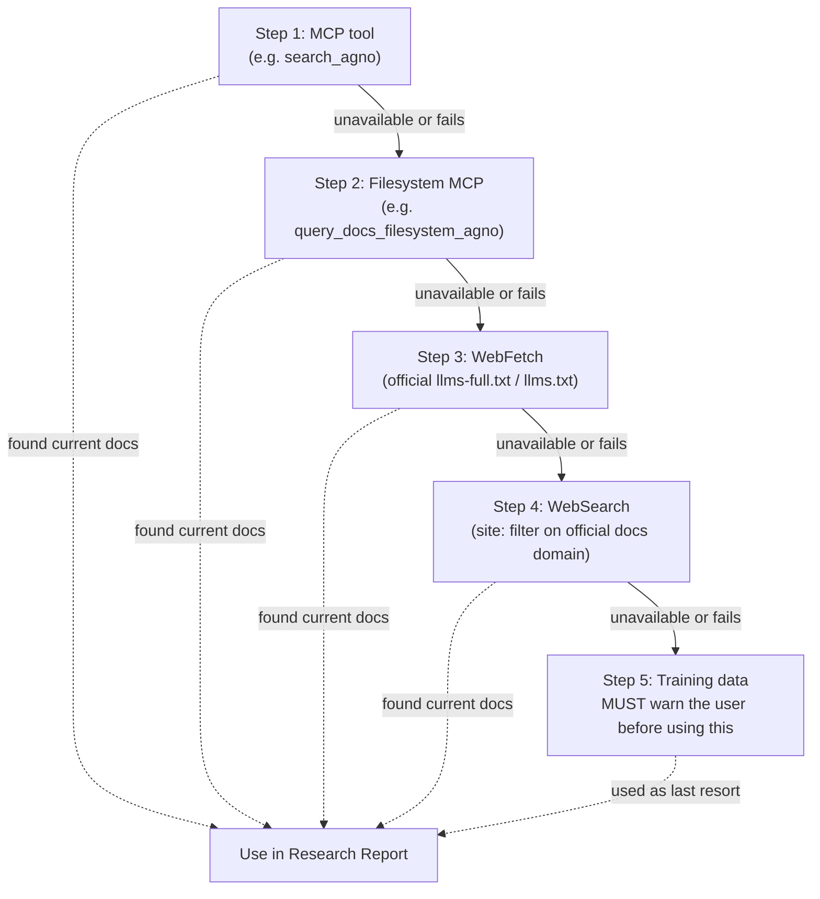

# CLAUDE.md — Recursive Agentic Improvements

Behavioral guidelines for Claude Code and human contributors working in this repository.
Adapted from the [Karpathy CLAUDE.md](https://github.com/multica-ai/andrej-karpathy-skills/blob/main/CLAUDE.md) and extended with project-specific rules.

**Priority order when rules conflict:** Core Invariants > Skill File Contract > Docs Contract > Style > Judgment.

---
# Strict Token Optimization Protocols

## 1. Response Verbosity
- **Moderate Explanations:** Provide minimal direct solution, fix, or code block. 
- **Moderate Chat:** Concise all pleasantries, introductions, summaries, and concluding remarks.
- **Inline Comments Only:** Place critical context strictly inside code blocks as short comments.
- **Diffs Only:** Output only the modified lines of code. Never print the entire file.

## 3. Tool Execution Constraints
- **Lazy Execution:** Execute tools only when explicitly necessary for the immediate task.
- **Fail Fast:** If a file path is ambiguous, stop and ask the user instead of searching the codebase.
---

## Project Snapshot

**What this is:** A collection of three Claude Code skills (slash commands) that let any developer create, improve, and extend AI agents across Agno, CrewAI, LangGraph, and Google ADK — for any domain, without preset templates.

**What this is NOT:** A framework, a library, or an agent runtime. The skills install into *other* projects. This repo is the source of truth for those skill files.

**Primary artifacts (in priority order):**

1. `.claude/commands/*.md` — The three skills. These ship to users.
2. `docs/**/*.md` — Per-framework reference guides that inform the skills.
3. `installer/` — The npx installer package that must stay in sync with `.claude/commands/`.

**Design goal:** A developer who runs `/create-agent agno` for a legal document summariser and one who runs it for a DevOps pipeline must both get a correct, production-quality scaffold — without the skill knowing about either use case in advance. The research phase does the discovery.

---

## Repository Map

```
.claude/
└── commands/             ← THE PRIMARY ARTIFACT. Skills install from here.
    ├── create-agent.md   → /create-agent  (Research → Plan → Scaffold)
    ├── improve-agent.md  → /improve-agent (Spec → Probes → Fix → Iterate)
    └── extend-agent.md   → /extend-agent  (Research → Plan → Implement)

docs/                     ← Reference guides consumed by the skills and humans
├── create-new-agent.md   → Framework-agnostic entry point
├── improve-agent.md      → Framework-agnostic improve reference
├── extend-agent.md       → Framework-agnostic extend reference
├── agno/
│   ├── chatbot/
│   └── research-assistant/
├── crewai/
│   ├── research-crew/
│   └── content-pipeline/
├── langgraph/
│   ├── react-agent/
│   └── multi-agent-supervisor/
└── google-adk/
    ├── chatbot/
    └── tool-using-agent/

tests/                    ← Showcase agents and tests for all frameworks
installer/                ← NPX installer package
README.md                 ← Public-facing documentation
LICENSE                   ← MIT
```

**Every `docs/<framework>/<use-case>/` must contain exactly three files:**
`create-new-agent.md`, `improve-agent.md`, `extend-agent.md`

---

## The `.gitignore` Trap

This repo's `.gitignore` excludes `*.md`, `*.py`, `*.json`, and most code file types by design. This prevents generated agent files (produced when testing skills inside this repo) from being accidentally committed.

**Consequence for contributors:** All currently tracked files were force-added before this rule. If you create a new file that must be committed, you must explicitly force-add it:

```bash
git add -f docs/my-new-framework/my-use-case/create-new-agent.md
git add -f .claude/commands/my-new-skill.md
git add -f README.md
```

**Never run `git add .` or `git add -A` in this repo.** It will silently stage nothing useful, or worse, accidentally include generated test artefacts from a local agent project.

---

## Core Invariants

These must never be violated. PRs that break any of these will be rejected without review.

### 1. Skills are self-contained and standalone

Each skill file (`.claude/commands/*.md`) must work correctly when copied in isolation into another project. It must:

- Embed all framework-specific guidance it needs — it must not reference `docs/` or assume this repo is present
- Define the full MCP fallback chain inline
- Define the framework structural patterns inline
- Work with or without this repository present

**Self-test:** Copy only `.claude/commands/create-agent.md` into a fresh project with no connection to this repo and run `/create-agent`. It must succeed.

### 2. Research always precedes code

Every skill must gate code generation behind a user-confirmed Research Report and Agent Blueprint. No skill may write any file before:

1. Querying live framework docs (MCP → WebFetch → WebSearch, in that order)
2. Outputting a Research Report displayed to the user
3. Outputting an Agent Blueprint / Extension Blueprint
4. Receiving explicit user confirmation

**The research phase is not optional, even for well-known use cases.** APIs change and training data goes stale. Live docs are authoritative.

### 3. MCP fallback chain must be complete

Every skill that touches framework-specific APIs must implement the full fallback chain in order:

```
1. MCP tool          (e.g., search_agno, search_docs_by_lang_chain)
2. Filesystem MCP    (e.g., query_docs_filesystem_agno)
3. WebFetch          (e.g., WebFetch https://docs.agno.com/llms-full.txt)
4. WebSearch         (with site: filter on official docs domain)
5. Training data     — warn the user explicitly before using this path
```

Never skip to training data when any of the steps above can be attempted. Never use WebFetch as the first attempt when an MCP tool exists for that framework.

**Why this order matters (plain English):** frameworks change their APIs faster than any model's training data. If a skill answers from memory first, it can confidently generate an import path or decorator that used to be correct and no longer is — exactly the kind of drift that breaks a generated agent silently. Each step below is only tried if the one above it is unavailable or fails:



An interactive version of this diagram is on the [live landing page, "Fallback Chain" section](https://cloudbloqavi.github.io/recursive-agentic-improvements/#fallback).

### 4. No domain hardcoding in skills

Skills handle **any domain** through dynamic research. Do not add:

- Domain-specific tool lists for particular industries (travel, legal, HR, etc.)
- Hardcoded agent names or purposes as defaults
- If/else branches that special-case specific use cases by name

The research phase handles domain discovery; skills stay domain-agnostic.

### 5. Blueprint confirmation is a hard gate

Each skill must explicitly wait for user confirmation after presenting the Blueprint before writing any files. The phrase (or equivalent) **"Wait for confirmation before continuing to Phase 3"** must appear in the skill. This gate cannot be relaxed, skipped, or made implicit.

### 6. Framework structural patterns must be accurate

The structural patterns embedded in skills (file names, module structures, required exports, decorator names) must be correct for the framework. Critical examples:

- **Google ADK:** `__init__.py` must contain `from . import agent`; `agent.py` must define `root_agent`
- **CrewAI:** `crew.py` requires `@CrewBase`, `@agent`, `@task`, `@crew` decorators
- **LangGraph:** multi-turn memory requires `checkpointer=InMemorySaver()` (from `langgraph.checkpoint.memory`; `MemorySaver` is a deprecated alias for the same class)
- **Agno:** memory requires `SqliteDb` (from `agno.db.sqlite`) or equivalent + `add_history_to_context=True`

When a framework releases a breaking change, update the structural pattern before the PR merges.

---

## Think Before Coding

**Don't assume. Don't hide confusion. Surface tradeoffs.**

This applies to both human contributors and Claude Code operating in this repo.

Before making any change:

- State your assumptions explicitly. If uncertain about an API, say so — do not fill in plausibly correct code.
- If multiple implementation approaches exist, name them. Don't silently pick one.
- If a section is unclear, name what's confusing and ask rather than guessing.
- If a simpler approach exists, say so. Push back when warranted.

Skill files are instructions that other AI instances execute at scale. A vague or incorrect instruction here becomes a hallucination in every user's project.

---

## Simplicity First

**Minimum effective content that solves the problem. Nothing speculative.**

When editing skill files or docs:

- No guidance beyond what was asked or what is demonstrably needed
- No abstractions for hypothetical future frameworks
- No "flexibility" that adds complexity without a concrete current use
- No error-handling prose for scenarios that cannot occur given the framework's guarantees

If a skill section is 40 lines and could be 15, rewrite it to 15.

Ask: "Would a senior AI engineer say this is over-specified?" If yes, simplify.

---

## Surgical Changes

**Touch only what you must. Clean up only your own mess.**

When editing existing skill files or docs:

- Do not "improve" adjacent sections, phrasing, or formatting that aren't broken
- Do not reformat sections you didn't change — this creates noise that hides real diffs
- Match the existing voice and structure of the file, even if you would do it differently
- If you notice an error in an adjacent section, file a separate issue or PR — don't bundle it

When your changes create orphans (a tool removed from a pattern, a step renumbered):

- Update every cross-reference in the same file
- Do not leave dangling step numbers or stale "see Step 4" references

**Every changed line must trace directly to the stated purpose of the PR.**

---

## Development Setup

This repo has no runtime dependencies. The skills are Markdown files that Claude Code interprets.

**Prerequisites to contribute:**

- Claude Code CLI installed and authenticated (`claude --version`)
- Git configured with your name and email
- A separate test project with at least one target framework installed (do not test inside this repo)
- A valid LLM API key (`ANTHROPIC_API_KEY`, `GOOGLE_API_KEY`, or equivalent)

**Recommended: MCP servers for live docs.** Add to `~/.claude/settings.json`:

```json
{
  "mcpServers": {
    "agno-docs": {
      "type": "http",
      "url": "https://docs.agno.com/mcp"
    },
    "langchain-docs": {
      "type": "http",
      "url": "https://docs.langchain.com/mcp"
    },
    "crewai-docs": {
      "type": "http",
      "url": "https://docs.crewai.com/mcp"
    },
    "context7": {
      "type": "http",
      "url": "https://mcp.context7.com/mcp"
    }
  }
}
```

`context7` is a general-purpose docs MCP (library ID `/google/adk-python`) and is the recommended way to cover Google ADK, which has no dedicated docs MCP server of its own.

Restart Claude Code after adding MCP servers.

**Discovering MCP servers for a new framework:** check the official [MCP Registry](https://registry.modelcontextprotocol.io) first — it is the community-maintained, searchable index of public MCP servers (launched Sept 2025) and is faster to check than guessing a docs-site URL. Only fall back to a manual `llms.txt`/`llms-full.txt` search when the registry has no entry for the framework.

**No build step, no linter, no test runner for this repo itself.** Testing is end-to-end: install the skill into a live project and run it.

---

## Skill File Contract

Every file in `.claude/commands/` must satisfy all of the following.

### Required sections

| Section | Must contain |
|---|---|
| Header | Usage line, at least 3 concrete examples with different frameworks |
| Phase 1 — Research | MCP check, full fallback chain, domain-derived search queries, Research Report template |
| Phase 2 — Plan | Blueprint template, explicit "Wait for confirmation" gate |
| Phase 3 — Implement | Structural patterns for **all 4** supported frameworks |
| Success Criteria | Specific, binary, measurable pass/fail criteria — not "the agent works" |

### Voice

Write as **second-person imperative instructions**:

- `"Search for tools related to the agent's domain."` — correct
- `"You should search..."` or `"Claude should search..."` — wrong

### Forbidden patterns in skill files

- Hardcoded domain names in search queries that aren't clearly derived from the user's description
- `WebFetch` as the first docs source when an MCP tool exists for that framework
- Code generation before Phase 2 confirmation
- Placeholder text inside structural patterns (e.g., `# implement this`, `# TODO`)
- Implicit confirmation gates ("proceed if no objections" — the user must affirmatively confirm)
- Recommending a specific agent name, slug, or domain in defaults

---

## Docs File Contract

Every file in `docs/<framework>/<use-case>/` must satisfy all of the following.

### Version annotation

Include at the top of each doc file:

```markdown
<!-- Validated against: agno==X.Y.Z — YYYY-MM-DD -->
```

Update this annotation whenever you verify the guide against the framework's current docs.

### Required sections per file

**`create-new-agent.md`:**

- `## Preconditions` — what must be true before running
- Numbered `## Step N` sections in sequential order
- At least one concrete, runnable code skeleton
- `## Smoke Tests` — minimum 3 probes: golden path, tool trigger, constraint
- `## Success Criteria` — binary pass/fail
- `## Commit` step

**`improve-agent.md`:**

- Spec location table (framework → where the spec lives in the project)
- Debug logging instructions per framework
- Exactly 10 probe categories (golden path ×3, edge case ×2, tool selection ×2, constraint ×2, adversarial ×1)
- Failure diagnosis table: symptom → root cause → fix
- `## Success Criteria`

**`extend-agent.md`:**

- Step to read the current agent state before modifying anything
- Docs source check for the framework
- Extension Blueprint template with regression probe section
- `## Success Criteria`

### Accuracy requirement

All API imports, class names, and parameter names must be verified against the framework's published documentation at time of writing. Do not write docs from training-data memory alone — look it up. If the correct API cannot be confirmed, say so explicitly in the doc rather than guessing.

---

## Adding a New Framework

Partial additions (e.g., one use case, or skill updates without matching docs) will not be merged. Follow this process in full.

**Step 1 — Verify documentation availability.**
Confirm the framework has at least one of: a public MCP server, an `llms.txt` / `llms-full.txt` at a stable URL, or well-indexed public docs reachable via WebSearch. Document the source in your PR.

**Step 2 — Create directory structure.**

```bash
mkdir -p docs/<framework-name>/<use-case-1>
mkdir -p docs/<framework-name>/<use-case-2>
# Minimum: 2 use cases per new framework
```

**Step 3 — Write all three doc files per use case.**
Follow the Docs File Contract above. Include version annotations.

**Step 4 — Update all three skill files** (`.claude/commands/*.md`):

- MCP / docs availability check table
- Full MCP fallback chain entry for the new framework
- Framework structural pattern section in Phase 3
- API key requirements table
- Agent architecture selection table

**Step 5 — Update `README.md`.**
Add the framework to the Supported Frameworks table and the MCP setup section.

**Step 6 — Test end-to-end** against a live project using the new framework.
All three skills must produce correct results. All smoke test probes must pass.

**Step 7 — Open a PR** that includes:

- Framework version and OS tested
- Docs source used (MCP URL, llms.txt URL, or WebSearch query)
- Smoke test results for each of the three skills
- Completed PR checklist (see Testing Protocol below)

---

## Adding a New Use Case to an Existing Framework

**Step 1 — Create the directory:**

```bash
mkdir -p docs/<framework>/<new-use-case>
```

**Step 2 — Write all three doc files** following the Docs File Contract.

**Step 3 — Update `README.md`** — add the use case to the framework table.

**Step 4 — Test.** Run `/create-agent <framework> <description matching the new use case>` against a live project. All 3 smoke probes must pass.

**Step 5 — Do not modify `.claude/commands/*.md`** unless the use case introduces a new architectural pattern or a new framework class that the skill doesn't already handle. If it does, that is a framework-level change — open a separate issue.

---

## Testing Protocol

### Before opening any PR

Every PR that modifies `.claude/commands/*.md` must confirm in the PR description:

- [ ] Skill tested end-to-end in a live project (not simulated)
- [ ] Framework version and OS recorded
- [ ] All 3 smoke test probes passed (for `/create-agent` changes)
- [ ] All 10 probes passed with zero regressions (for `/improve-agent` changes)
- [ ] Both new-capability + regression probes passed (for `/extend-agent` changes)
- [ ] No import errors or tool failures in debug logs
- [ ] Changes on a feature branch (not `main`)
- [ ] Files force-added with `git add -f` (not `git add .`)

### For doc-only PRs

- [ ] Version annotation added or updated at top of each changed file
- [ ] All code snippets verified against the stated framework version
- [ ] No links to private, authenticated, or unstable doc pages

### Self-testing a skill in isolation

```bash
# macOS / Linux
# 1. Create an isolated test project (validates standalone contract)
mkdir /tmp/test-agent-project && cd /tmp/test-agent-project
git init
pip install agno   # or crewai / langgraph / google-adk

# 2. Copy ONLY the skill being tested
mkdir -p .claude/commands
cp /path/to/recursive-agentic-improvements/.claude/commands/create-agent.md .claude/commands/

# 3. Set API key
export ANTHROPIC_API_KEY=sk-...

# 4. Open Claude Code and run the skill
# Then: /create-agent agno a travel assistant that searches flights and books hotels

# 5. Verify:
#   - Research Report shown before any code is written
#   - Blueprint shown and explicitly waits for confirmation
#   - Code written only after confirmation
#   - All 3 smoke probes pass
#   - No import errors in logs
```

```powershell
# Windows (PowerShell) — same 5 steps, native syntax
New-Item -ItemType Directory -Path "$env:TEMP\test-agent-project" | Out-Null
Set-Location "$env:TEMP\test-agent-project"
git init
pip install agno   # or crewai / langgraph / google-adk

New-Item -ItemType Directory -Path ".claude\commands" -Force | Out-Null
Copy-Item C:\path\to\recursive-agentic-improvements\.claude\commands\create-agent.md .claude\commands\

$env:ANTHROPIC_API_KEY = "sk-..."

# Then open Claude Code and run the skill, and verify the same 5 checks as above.
```

---

## Commit Conventions

Use conventional commits. All commits must match:

```
<type>(<scope>): <imperative present-tense summary>
```

**Types:**

| Type | When to use |
|---|---|
| `feat` | New framework, new use case, new skill capability |
| `fix` | Incorrect API, broken structural pattern, wrong import path, broken MCP fallback |
| `docs` | README, doc file corrections, version annotations |
| `refactor` | Restructuring skill sections without changing observable behaviour |
| `test` | Adding or improving smoke test probes in docs |
| `chore` | Installer updates, `.gitignore`, CI config |

**Scope:** the skill name or framework affected. Examples:

```
feat(create-agent): add human-in-the-loop interrupt pattern for LangGraph
fix(agno): correct MCPTools import path for v1.4+
docs(crewai): validate content-pipeline guide against crewai==0.80.0
chore(install): add --dry-run flag to PowerShell installer
```

**Never:**

- Commit directly to `main`
- Force-push to any shared branch
- Use `git add .` or `git add -A` (see .gitignore trap)
- Amend commits that have been pushed to a shared remote
- Bundle unrelated fixes into one commit

---

## What NOT to Do

### In skill files (`.claude/commands/*.md`)

- **Do not add domain-specific branches.** No `if domain == "travel"`. The research phase handles discovery dynamically.
- **Do not list specific third-party tools for specific industries** as defaults. Research finds them.
- **Do not skip the Research phase** for use cases you consider obvious. APIs change; live docs are authoritative.
- **Do not remove the Blueprint confirmation gate.** Users must have the opportunity to redirect before files are created.
- **Do not hardcode a single model as immutable.** Default to `claude-sonnet-4-6` but do not prohibit alternatives.
- **Do not write error-recovery logic** for framework failures — emit the error to the user and stop.
- **Do not reference `docs/`** inside a skill file. Skills are standalone.

### In docs files (`docs/**/*.md`)

- **Do not write docs for unreleased or internal framework features.**
- **Do not reference private or authenticated doc URLs.**
- **Do not invent APIs.** If you cannot find the correct import in published docs, say so explicitly in the doc.
- **Do not generate code from training-data memory without verification.** Look it up.

### In this repo generally

- **Do not run `git add .`** (see .gitignore trap).
- **Dependencies management** uses the `uv` toolchain. There is no root-level `pyproject.toml` — each framework showcase under `tests/<framework>/` has its own isolated `pyproject.toml` and `uv.lock` (see [Showcase README](tests/README.md)).
- **Do not generate example agents in this repo.** Generated agents live in other projects.
- **Do not add a separate CONTRIBUTING.md** that contradicts this file. This CLAUDE.md is the contribution guide.
- **Do not add CI that requires repository secrets.** Keep CI runnable with public permissions.

---

## Behavioral Guidelines for Claude Code

When Claude Code works in this repository, these rules apply in addition to all of the above.

### One fix per failing probe

When running the improve loop:

- Make one targeted change
- Re-run only the failed probe
- Verify it passes
- Then move to the next failure

Do not batch-fix multiple failures in one edit. Batching makes it impossible to isolate which fix resolved which failure and creates regression risk.

### Verify imports before writing structural patterns

When adding or updating a framework structural pattern in a skill:

1. Look up the import path from the framework's current docs (use MCP if available)
2. Verify the class name exists in the installed version
3. Only then write or update the pattern

Do not write `from agno.tools.exa import ExaTools` without verifying `ExaTools` is the correct class name in the target version.

### The agent spec is the source of truth for improve probes

When working on `/improve-agent`, derive probes from the agent's actual `INSTRUCTIONS` / `SYSTEM_PROMPT` / `agents.yaml` — not from what you think the agent should do in general. If the spec says "always use `search_tool` for flight queries", that is the requirement. Do not create probes for behaviours not described in the spec.

### Goal-driven, not motion-driven

Transform vague tasks into verifiable criteria before starting:

- `"Improve the skill"` → `"Fix probe 3 (constraint) and probe 7 (tool selection), verify both pass, no regressions on 1–2 and 4–6"`
- `"Update the docs"` → `"Add version annotation, verify all imports against agno==1.x.x, re-run smoke tests"`

Weak success criteria produce wholesale rewrites. Specific criteria produce surgical changes.

### Do not narrate the process

Do not output running commentary ("Now I will search for tools…", "I have found the following…"). Output structured artefacts (Research Report, Blueprint, probe results) at the defined phases. Everything else is noise.

---

## Supported Frameworks Reference

Update this table whenever a framework is added, removed, or a minimum version changes.

| Framework | Min version tested | Docs source | MCP URL | Key note |
|---|---|---|---|---|
| Agno | 2.9.0 | MCP + llms-full.txt | `https://docs.agno.com/mcp` | Use `Claude(id=...)` for Anthropic models |
| CrewAI | 1.15.17 | MCP + llms.txt | `https://docs.crewai.com/mcp` | `crewai create crew <slug>` to scaffold |
| LangGraph | 1.2.11 | MCP + llms.txt | `https://docs.langchain.com/mcp` | `create_react_agent` moved to `langchain.agents.create_agent` (V1.0+); requires `LANGSMITH_API_KEY` for tracing |
| Google ADK | 2.9.1 | Context7 (`/google/adk-python`) + WebFetch llms.txt | `https://mcp.context7.com/mcp` (general-purpose, no ADK-dedicated server exists) | `root_agent` must be defined in `agent.py` |

---

## License

MIT. See [LICENSE](LICENSE). All contributions must be MIT-compatible. By opening a PR you agree that your contribution is submitted under MIT.
