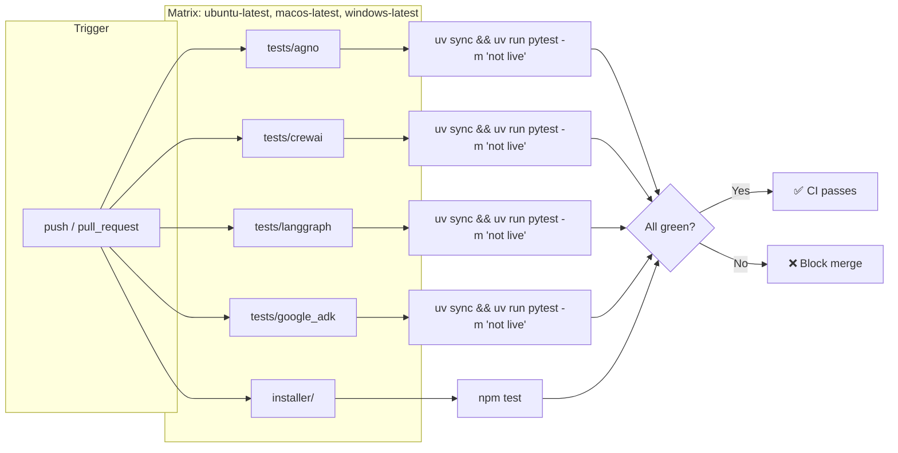

# Showcase Agents & Tests

This directory contains static, verified reference implementations of minimal agents for each supported framework. All showcase tests follow the repository's [Test Constitution](../tests/TEST_CONSTITUTION.md) utilizing mocked execution layers for fast, deterministic execution.

Developers and collaborators can use these examples to:
1. Verify their environment setup before installing the skills.
2. Run as a test target for `/improve-agent` or `/extend-agent` to check how the recursive improvement loops function.
3. Understand the standard file structures, import paths, and syntax used by the latest versions of each framework.

---

## Supported Frameworks & Tested Versions

| Framework | Verified Version | Showcase Path | Run Command |
|---|---|---|---|
| **Agno** | 2.9.0 | `tests/agno/` | `python -m tests.agno.agent_test` |
| **CrewAI** | 1.15.17 | `tests/crewai/` | `python -m tests.crewai.main` |
| **LangGraph** | 1.2.11 | `tests/langgraph/` | `python -m tests.langgraph.run` |
| **Google ADK** | 2.9.1 | `tests/google_adk/` | `python -m tests.google_adk.run` |

---

## Setup & Run Instructions

Each framework showcase is an **isolated** `uv` project: its own `pyproject.toml` and `uv.lock` live inside `tests/<framework>/`. This keeps each framework's dependency tree (and any version conflicts between them) fully separate. There is no root-level `pyproject.toml` — always `cd` into the framework's directory first, then run `uv sync` / `uv run pytest` from there. This is identical on macOS, Linux, and Windows; `uv` resolves the platform-specific virtual environment for you.

### Framework Showcase Command Summary

| Framework | Setup + Run Tests | Run Agent Command |
|---|---|---|
| **Agno** | `cd tests/agno && uv sync && uv run pytest` | `uv run python -m tests.agno.agent_test` |
| **CrewAI** | `cd tests/crewai && uv sync && uv run pytest` | `uv run python -m tests.crewai.main` |
| **LangGraph** | `cd tests/langgraph && uv sync && uv run pytest` | `uv run python -m tests.langgraph.run` |
| **Google ADK** | `cd tests/google_adk && uv sync && uv run pytest` | `uv run python -m tests.google_adk.run` |

> [!NOTE]
> Ensure you copy the environment template (`cp .env.example .env` on macOS/Linux, `Copy-Item .env.example .env` on Windows PowerShell) and populate the required API keys (e.g. `OPENAI_API_KEY`, `GOOGLE_API_KEY`) before running the agents. Tests themselves are fully mocked (see `TEST_CONSTITUTION.md`) and do not need real API keys.

---

### Direct Execution via `uv` (Recommended)

Run the following commands from the repository root — each block changes into the framework's own directory:

#### Agno Calculator Agent
```bash
cd tests/agno
uv sync                              # install this framework's own dependencies
uv run python -m tests.agno.agent_test   # run the agent
uv run pytest                        # run its unit tests
```

#### CrewAI Research & Writing Crew
```bash
cd tests/crewai
uv sync
uv run python -m tests.crewai.main
uv run pytest
```

#### LangGraph Multiplication Agent
```bash
cd tests/langgraph
uv sync
uv run python -m tests.langgraph.run
uv run pytest
```

#### Google ADK Weather Agent
```bash
cd tests/google_adk
uv sync
uv run python -m tests.google_adk.run
uv run pytest
```

---

### Continuous Integration

Every push and pull request runs all four showcases (non-`live` tests only) plus the installer's unit tests, across Ubuntu, macOS, and Windows, in [`.github/workflows/ci.yml`](../.github/workflows/ci.yml) — no repository secrets required, since the showcase tests use mocked model calls and the installer tests only touch temp directories. See the [Live Landing Page](https://cloudbloqavi.github.io/recursive-agentic-improvements/) or the diagram below for the pipeline shape:


